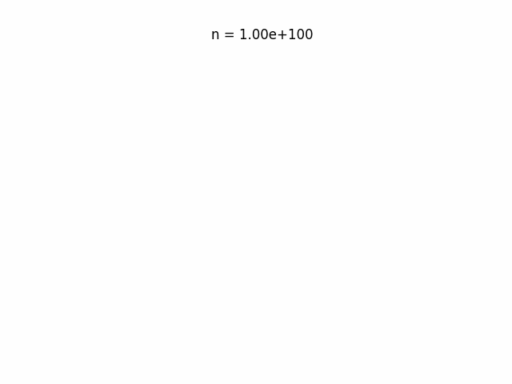
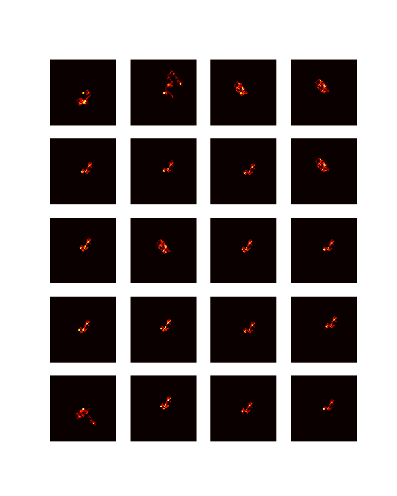

# Collatz's Ant

Visualization for collatz sequences based on [Langton's ant](https://en.wikipedia.org/wiki/Langton%27s_ant).

Additionally to what's the [Collatz function](https://en.wikipedia.org/wiki/Collatz_conjecture)($f(n) = n/2$ if $n$ even, else $f(n) = 3n + 1$) if $n$ even, the ant turns 90º clockwise, else the ant turns 90º counter-clockwise. On both accounts, the state of the cell is flipped and the ant moves forward one unit. This is repeated until $n = 1$.

### Some examples

Example of consecutive trajectories in a single gif (from $n = 10^{30}$ to $n = 10^{30} + 20$).

Keeping count at each point (not flipping state), for corresponding trajectories.

